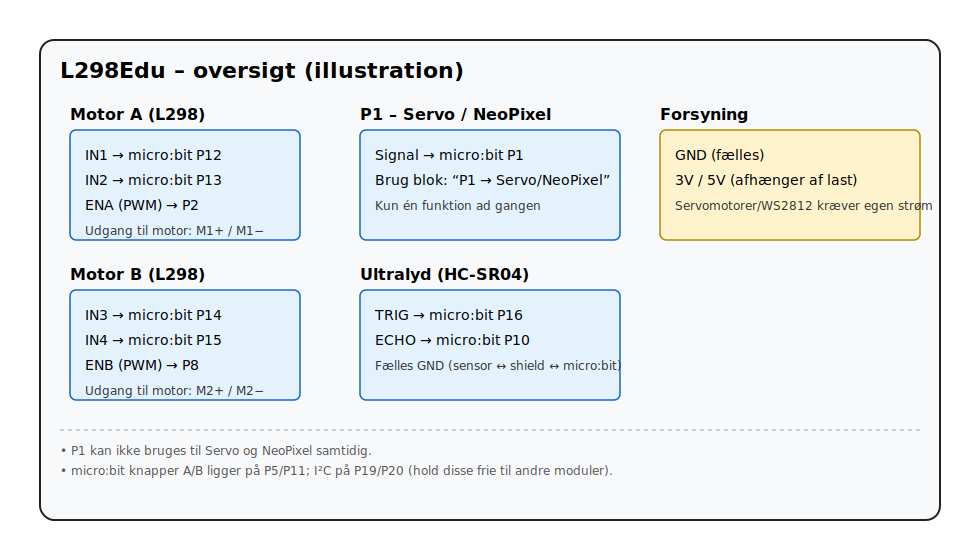

# L298Edu
MakeCode blocks for motor, servo and ultrasonic sensor on custom micro:bit breakout board with P1 available for either servo or WS2812 
# L298Edu

**MakeCode-extension til micro:bit** for et motorshield/breakout med:
- Motor A/B (H-bro) – *basisblokke*
- P1 som **Servo** *eller* **NeoPixel (WS2812)** – *avancerede blokke*
- Ultralyd (HC-SR04) – *avanceret*

> Bemærk: P1 kan ikke køre Servo og NeoPixel samtidig. Vælg først tilstand via blokken **“P1 → …”**.

## Installation
MakeCode → **Extensions** → indsæt:github:/Oldmanne13/L298Edu

## Hurtig start
**Motor (basis):**
- “A frem %speed”, “A baglæns %speed”, “Stop A”
- “B frem %speed”, “B baglæns %speed”, “Stop B”
- “A+B frem/baglæns %speed”

**Servo (P1):**
1. “**P1 → Servo**”
2. “**Servo P1: %vinkel °**”

**NeoPixel (P1):**
1. “**P1 → NeoPixel**” *(eller kald “WS2812 P1: %n LED” direkte, som sætter tilstanden)*
2. Arbejd videre med NeoPixel-blokkene på den returnerede `strip`.

**Ultralyd:**
- “**Afstand (cm)**” bruger P16 (trigger) og P10 (echo). LED-matrix slås fra for præcis måling.

## Krav
- micro:bit v1 eller v2
- `neopixel`-dependency er inkluderet i `pxt.json`.

## Licens
MIT
## Pinout

| Funktion | micro:bit-pin | Beskrivelse |
|---|---:|---|
| **Motor A – retning** | P12 (IN1), P13 (IN2) | Sættes 10 / 01 for frem/baglæns |
| **Motor A – hastighed (PWM)** | P2 (ENA) | 0–1023 |
| **Motor B – retning** | P14 (IN3), P15 (IN4) | Sættes 10 / 01 for frem/baglæns |
| **Motor B – hastighed (PWM)** | P8 (ENB) | 0–1023 |
| **Servo / NeoPixel** | P1 | Vælg tilstand i blokken “P1 → %mode” |
| **HC-SR04** | P16 (TRIG), P10 (ECHO) | 5V sensor; fælles GND |
| **Forsyning** | 3V/5V, GND | Afhænger af dit shield/last |

> **Bemærk:** P1 kan kun bruges til én ting ad gangen (Servo **eller** NeoPixel).

